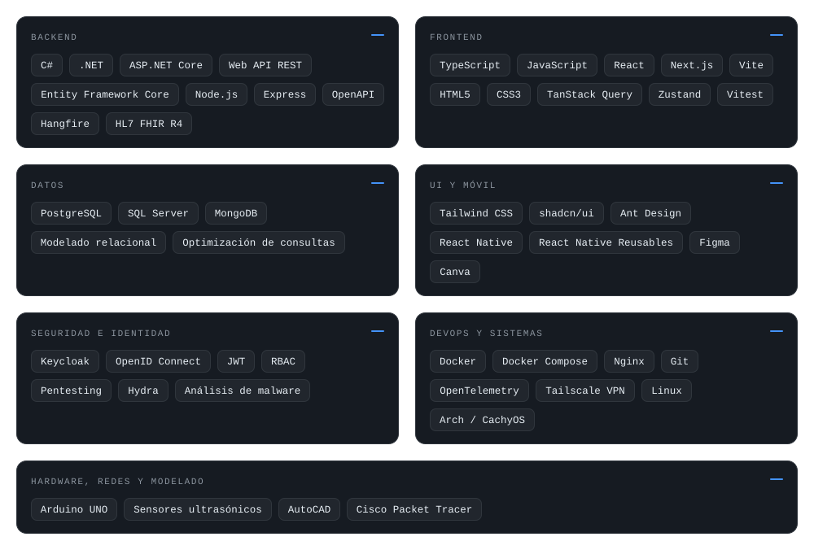
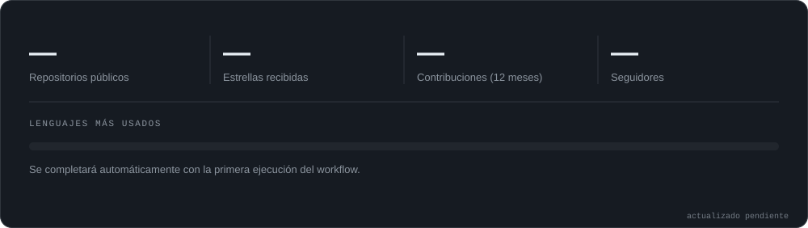

 

[Sobre mí](#sobre-mí) &nbsp;·&nbsp; [Stack](#stack-tecnológico) &nbsp;·&nbsp; [Proyectos](#proyectos-destacados) &nbsp;·&nbsp; [Actividad](#actividad-en-github) &nbsp;·&nbsp; [Contacto](#contacto)

## Sobre mí

Soy estudiante de Ingeniería en Sistemas en la **UNAH-CUROC** y desarrollador Full-Stack apasionado por la arquitectura de software, las aplicaciones web y móviles escalables y la ciberseguridad.

Me interesa todo el ciclo de un producto: modelar el dominio, diseñar la API, construir la interfaz y desplegarla de forma segura. Trabajo con transacciones atómicas, control de acceso granular y arquitecturas pensadas para crecer.

- **Abierto a:** proyectos freelance, colaboraciones y oportunidades como desarrollador Full-Stack.
- **Pregúntame sobre:** .NET, React, modelado de bases de datos y laboratorios de ciberseguridad.

<!--
  Opcional, descomenta y completa:
- **Actualmente:** ...
- **Aprendiendo:** ...
-->

## Stack tecnológico

## Proyectos destacados

### SIGREF
**Sistema de gestión administrativa para organizaciones de salud.**

Centraliza pacientes, servicios, caja, ingresos, facturación, reportes y auditoría en una sola plataforma, reduciendo tareas manuales y dando trazabilidad a cada operación.

- **Stack:** `.NET 9` · `ASP.NET Core` · `React 19` · `TypeScript` · `PostgreSQL` · `MongoDB` · `Keycloak` · `HL7 FHIR R4` · `Docker`
- **Módulos:** pacientes y profesionales, catálogos de servicios, sesiones de caja, facturación e ingresos, dashboards y reportes.
- **Auditoría y trazabilidad** de eventos y cambios, con almacenamiento documental en MongoDB.
- **Seguridad:** autenticación con Keycloak (OpenID Connect / JWT) y autorización basada en roles (RBAC).
- **Interoperabilidad clínica** con HL7 FHIR R4.
- **Procesamiento en segundo plano:** tareas y reportes con un worker dedicado (Hangfire).
- **Contratos tipados de punta a punta:** API documentada con OpenAPI y cliente TypeScript generado con Orval.
- **Observabilidad y despliegue:** OpenTelemetry y entornos reproducibles con Docker Compose y Nginx.
- **Equipo:** proyecto desarrollado por 8 personas. <!-- Agrega aquí tu rol: **Mi aporte:** ... -->
- **Licencia:** software propietario, código no público.

### Laboratorio de simulación de Pentesting
**Entorno controlado para practicar ciberseguridad ofensiva y defensiva.**

- **Stack:** `Tailscale VPN` · `Hydra` · `OpenSSH` · máquinas virtuales
- Red de máquinas virtuales interconectadas mediante Tailscale VPN.
- Simulación de vectores de ataque, incluyendo fuerza bruta con Hydra sobre OpenSSH.
- Análisis forense y estrategias de mitigación, con estudio de ransomware (caso Conti).
- Todo el trabajo se realiza en entornos propios y con fines educativos.

## Actividad en GitHub

## Objetivos

- Profundizar en arquitectura de software (DDD, Clean Architecture) y sistemas distribuidos.
- Fortalecer mis habilidades en ciberseguridad aplicada al desarrollo seguro.
- Seguir construyendo productos que resuelvan problemas reales para negocios en Honduras y la región.

## Contacto

**GitHub:** [github.com/MichaelGald](https://github.com/MichaelGald)
<!-- Agrega aquí LinkedIn / correo:
**LinkedIn:** [linkedin.com/in/tu-perfil](https://linkedin.com/in/tu-perfil)
**Correo:** tu-correo@dominio.com
-->

¿Tienes un proyecto en mente? Hablemos.
